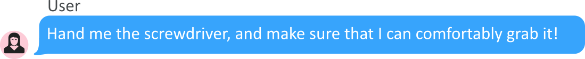

# Text2Interaction: Establishing Safe and Preferable Human-Robot Interaction
This is code used in *"Text2Interaction: Establishing Safe and Preferable Human-Robot Interaction,"* presented at CoRL 2024.

For a brief overview of our work, please refer to our [project page](https://sites.google.com/view/text2interaction/).

Further details can be found in our paper available on [arXiv](https://arxiv.org/abs/2408.06105v1).


<p align="center">
  <table>
    <tr>
      <td><p align="center">Without Text2Interaction</p></td>
      <td><p align="center">With Text2Interaction</p></td>
    </tr>
  </table>
</p>

## Abstract
Adjusting robot behavior to human preferences can require intensive human feedback, preventing quick adaptation to new users and changing circumstances. Moreover, current approaches typically treat user preferences as a reward, which requires a manual balance between task success and user satisfaction. To **integrate new user preferences in a zero-shot manner**, our proposed Text2Interaction framework invokes large language models to generate a task plan, motion preferences as Python code, and parameters of a safe controller. By **maximizing the combined probability of task completion and user satisfaction** instead of a weighted sum of rewards, we can reliably find plans that fulfill both requirements. We find that **83% of users working with Text2Interaction agree that it integrates their preferences into the robot’s plan**, and 94% prefer Text2Interaction over the baseline. Our ablation study shows that Text2Interaction aligns better with unseen preferences than other baselines while maintaining a high success rate.

## Our work is split in two major parts:

 1. [Training skills, planning, and evaluation](https://github.com/JakobThumm/STAP/): We first use offline reinforcement learning to learn the robotic skills. We then plan an optimal robot plan that satisfies the user preferences *and* has a high success rate.
 2. [Generate preference functions](https://github.com/JakobThumm/text2interaction/tree/main/fm-planning): This code is used to generate the custom preference functions from user instructions using a large language model.

We describe the purpose, installation, steps to reproduce our results, and implementation details in greater detail in the README files of the two sub-repos. 
For your convenience, we added both code bases as git submodules to this repository.

# Citation
Text2Interaction is offered under the MIT License agreement. 
If you find Text2Interaction useful, please consider citing our work:
```
@inproceedings{thumm_2024_Text2InteractionEstablishing,
  title = {Text2Interaction: Establishing Safe and Preferable Human-Robot Interaction},
  shorttitle = {Text2Interaction},
  booktitle = {8th Annual Conference on Robot Learning},
  author = {Thumm, Jakob and Agia, Christopher and Pavone, Marco and Althoff, Matthias},
  year = {2024},
  url = {https://openreview.net/forum?id=s0VNSnPeoA&referrer=%5BAuthor%20Console%5D(%2Fgroup%3Fid%3Drobot-learning.org%2FCoRL%2F2024%2FConference%2FAuthors%23your-submissions)},
  langid = {english},
}
```
