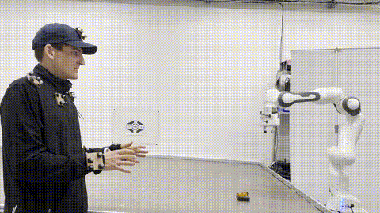
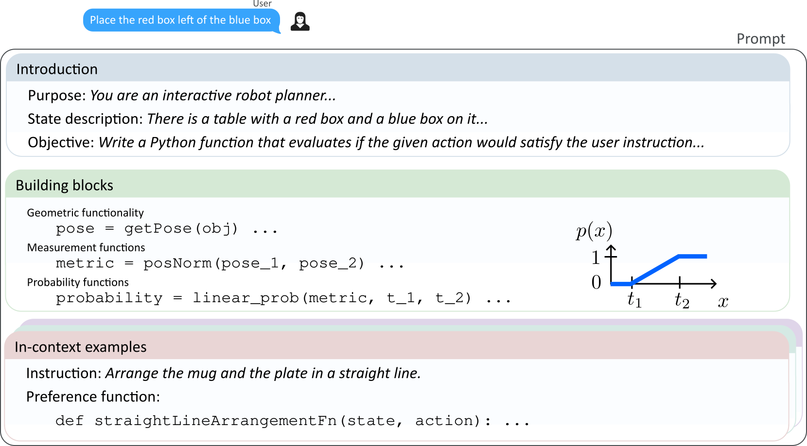
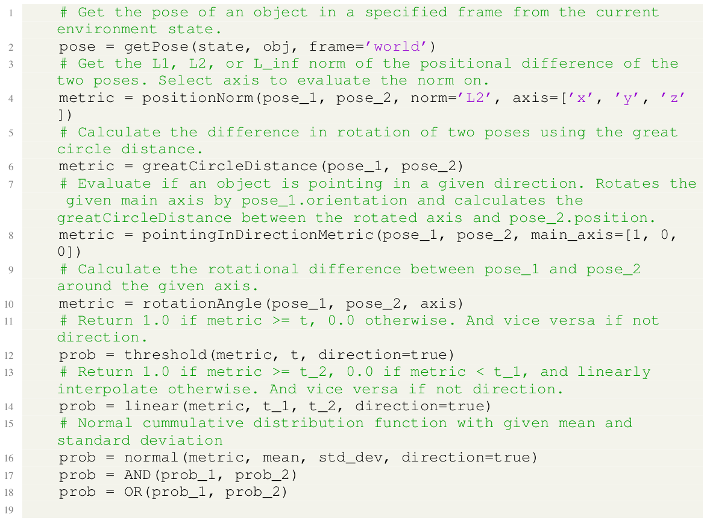
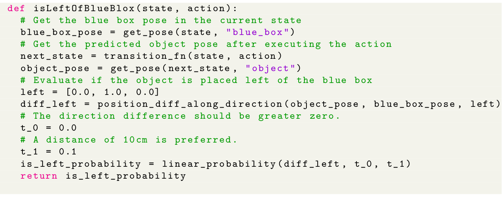
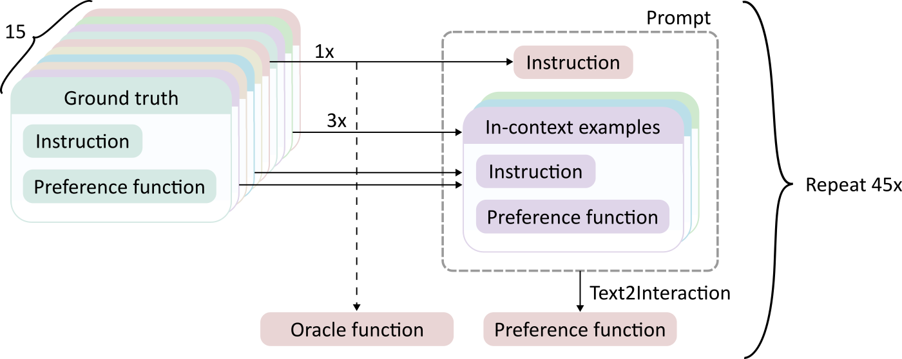

# Text2Interaction Preference Function Generation
This is the custom preference function generation code used in *"Text2Interaction: Establishing Safe and Preferable Human-Robot Interaction,"* presented at CoRL 2024.
This code prompts a large language model (LLM) to generate custom preference functions for the given task.

For a brief overview of our work, please refer to our [project page](https://sites.google.com/view/text2interaction/).

Further details can be found in our paper available on [arXiv](https://arxiv.org/abs/2408.06105v1).


<p align="center">
  <table>
    <tr>
      <td><p align="center">Without Text2Interaction</p></td>
      <td><p align="center">With Text2Interaction</p></td>
    </tr>
  </table>
</p>

# Table of Contents
1. [Prompt design](#prompt-design)
2. [Installation](#installation)
3. [Generate preference functions](#generate-preference-functions)
    - [Real-world preference functions](#real-world-preference-functions)
    - [Ablation study: object rearrangement](#ablation-study-object-rearrangement)
4. [Citation](#citation)

# Prompt design



Our prompts generally consist of three parts
 1. **Introduction:** Defines the general purpose of the LLM and the objective of this task. Gives a detailed descritpion of the state (based on generated output of [our environment](https://github.com/JakobThumm/STAP/)). 
 2. **Building block functions:** Introduces the python helper functions that the LLM should use to construct the preference function. Using these helper functions guarantees that the output of the function is in the correct format and reduces the chance of runtime errrors. Here are examples of common building block functions:
 
 3. **In-context examples:** (Instruction, preference function) pairs that serve as examples for the LLM. This improves robustness of the LLM output as long as the new instruction is semantically n-context with the given examples.

The final generated preference function could look like this:


# Installation
You can create a conda environment using
```
conda env create -f environment.yml 
```
or use your own python environment.
Install this package using
```
poetry install
```
or 
```
pip install .
```

# Generate preference functions
Make sure to set the environment variable `TEXT2INTERACTION_API_KEY`:
```
export TEXT2INTERACTION_API_KEY=...
```
The default model is OpenAI GPT4, for which you need an OpenAI API key. You can also change the default model using the `--model-config` option in the commands below. 

## Real-world preference functions
```
python scripts/eval/eval_preference_fn.py --api-key $TEXT2INTERACTION_API_KEY
```

## Ablation study: object rearrangement
For our object rearrangement ablation, we hand-scripted 15 user instructions and corresponding example oracle preference functions.
Our LLM prompt then gets the instruction and environment description of a task as input in addition to a set of three random in-context examples from the set of tasks. From this, we generate a preference function for the given instruction.



### Create an example object rearrangement preference function
```
python scripts/eval/ablation_preference_fn.py --api-key $TEXT2INTERACTION_API_KEY --examples 1 6 10 --eval-example 0 --verbose
```

### Create a single ablation trial with all files
```
python scripts/eval/cross_eval_ablation.py --api-key $TEXT2INTERACTION_API_KEY --stap-path $STAP_PATH --seed 0 --n-examples 3 --n-trials 1
```

### Create all ablation trials with all files
```
python scripts/eval/cross_eval_ablation.py --api-key $TEXT2INTERACTION_API_KEY --stap-path $STAP_PATH --seed 0 --n-examples 3 --n-trials 45
```

# Citation
Text2Interaction is offered under the MIT License agreement. 
If you find Text2Interaction useful, please consider citing our work:
```
@inproceedings{thumm_2024_Text2InteractionEstablishing,
  title = {Text2Interaction: Establishing Safe and Preferable Human-Robot Interaction},
  shorttitle = {Text2Interaction},
  booktitle = {8th Annual Conference on Robot Learning},
  author = {Thumm, Jakob and Agia, Christopher and Pavone, Marco and Althoff, Matthias},
  year = {2024},
  url = {https://openreview.net/forum?id=s0VNSnPeoA&referrer=%5BAuthor%20Console%5D(%2Fgroup%3Fid%3Drobot-learning.org%2FCoRL%2F2024%2FConference%2FAuthors%23your-submissions)},
  langid = {english},
}
```
